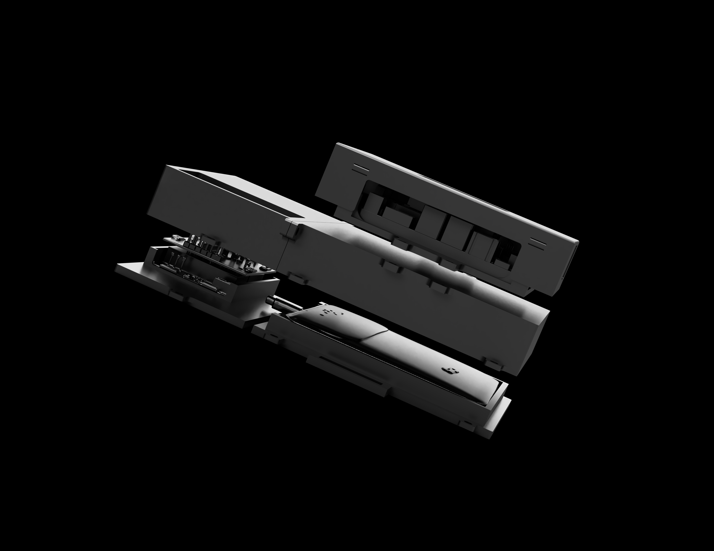
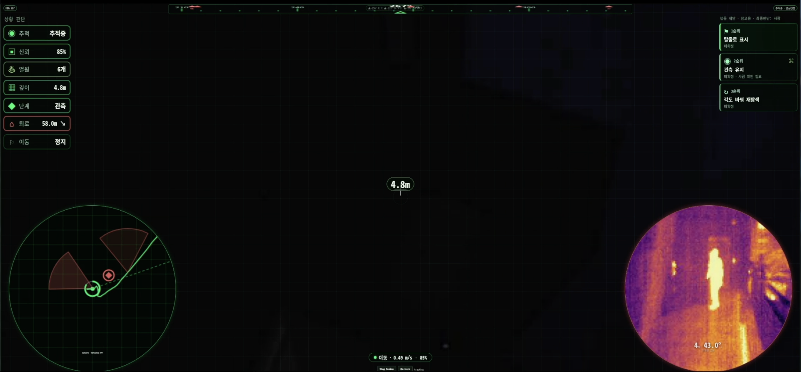

# Nyx



> GPS가 끊기고, 통신이 약해지고, 공간이 반복될 때  
> Nyx는 대원에게 “계속 가라”가 아니라 **다시 확인할 기준점**을 줍니다.

Nyx는 로컬에서 통신없이 작동하는 온디바이스 AI 솔루션입니다. GPS, 통신,
클라우드 접근, 현장 확신이 동시에 약해지는 상황에서 대원이 방향감과 판단 기준을
잃지 않도록 돕습니다.

Nyx는 전술 지휘 체계가 아닙니다. 사람, 위협, 무기, 위험물, 진입 가능 여부를
식별하거나 확정하지 않습니다. 이 공개 레포는 **신호가 약한 공간에서 과신을 막는
인터페이스 패턴**을 보여주는 D4D 제출용 데모입니다.

```text
약한 증거 -> 보수적 상태 판단 -> 짧은 행동 카드 -> 사람의 최종 판단
```

## 데모 영상 스크린샷



## 3분 발표 흐름

### 0:00 - 문제

현장 대원이 가장 위험해지는 순간은 “정보가 없는 순간”이 아닙니다.

더 위험한 순간은 정보가 조금 있어서, 그 약한 정보를 확신으로 착각하는 순간입니다.

지하 터널, 도시 지하, 참호, 폐건물, 재난 현장에서는 세 가지가 동시에 흔들립니다.

| 깨지는 것 | 현장에서 생기는 일 |
|---|---|
| 위치 | GPS가 약하거나 없고, 지도가 현재 공간과 맞지 않습니다. |
| 통신 | 상급부대, 동료, 클라우드 판단을 바로 받을 수 없습니다. |
| 지각 | 긴 복도, 반복되는 문, 어둠, 먼지, 연기 때문에 단서가 비슷해 보입니다. |

이때 필요한 것은 “더 똑똑한 한 문장”이 아니라,
**지금 무엇을 확정하지 말아야 하는지**와 **무엇을 다시 확인해야 하는지**입니다.

### 0:45 - 누가 겪는 문제인가

Nyx가 상정하는 사용자는 영웅 한 명이 아니라, 압박 속에서 짧게 판단해야 하는 팀입니다.

| 사용자 | 실제 순간 | 페인포인트 |
|---|---|---|
| 분대장 / 팀 리더 | 지하 통로, 참호선, 폐건물 내부에서 경로를 유지해야 함 | 마지막 체크포인트가 낡았는데 계속 전진해도 되는지 판단하기 어렵습니다. |
| 공병 / 수색 인원 | 터널 입구, 붕괴 위험 공간, 반복되는 구조물을 확인함 | 단서 하나만 보고 “안전”, “위협”, “목표 도달”로 과잉 확정하기 쉽습니다. |
| 상황실 / 인계 담당 | 현장 팀의 짧고 끊긴 보고를 받아 다음 팀에 넘김 | 무엇이 사실이고 무엇이 추정인지 분리되지 않아 인계 품질이 떨어집니다. |

작전 유형으로 보면 Nyx가 보는 순간은 넓지 않습니다.

| 작전 / 임무 상황 | Nyx가 돕는 지점 |
|---|---|
| 도시 지하 수색 | 지하 주차장, 지하철, 지하 연결 통로에서 반복 구조 때문에 경로감이 흐려지는 순간 |
| 땅굴 / 터널 의심 지역 확인 | 입구, 환기 흔적, 반복 통로처럼 단서가 약할 때 사실과 추정을 분리해야 하는 순간 |
| 참호선 / 엄폐 공간 이동 | 전자전과 감시 압박으로 GPS, 드론, 무전 확신이 약해지는 순간 |
| 재난 / 구조 수색 | 붕괴, 연기, 정전으로 지도와 시야가 맞지 않아 인계 가능한 짧은 판단 카드가 필요한 순간 |

Nyx는 이 사람들을 대신 판단하지 않습니다.

대신 판단 직전에 다음 네 가지 상태로 화면을 줄입니다.

```text
RE-ORIENT  마지막으로 믿을 수 있는 기준점을 회복
REALIGN    경로와 관찰 단서가 어긋나면 재정렬
HOLD       증거가 약하면 확정 금지
HANDOFF    다른 팀이나 자산으로 인계
```

### 1:35 - 왜 지금 중요한가

이 문제는 미래형 상상이 아니라 반복되는 전장 패턴입니다.

| 공개 사례 | 보여주는 문제 | Nyx가 가져온 설계 원칙 |
|---|---|---|
| 베트남전과 지하 터널 | 지하 공간은 지상 감시와 화력 우세를 약화시키고, 소규모 인원을 어둡고 좁은 공간으로 밀어 넣습니다. | 넓은 지도가 아니라 “마지막으로 믿을 수 있는 기준점”이 중요합니다. |
| 한반도 땅굴 위협 | DMZ 일대의 침투 터널 사례는 지하 경로 문제가 한국 안보에서 추상적 시나리오가 아님을 보여줍니다. | 지하 경로 신뢰도를 별도 상태로 다루고, 확신이 낮으면 전진보다 확인을 먼저 둡니다. |
| 우크라이나 전쟁의 참호와 전자전 | 드론, 재밍, 통신 저하는 GPS와 원격 판단이 언제든 약해질 수 있음을 보여줍니다. | 로컬 화면만으로도 `HOLD`, `REALIGN`, `HANDOFF`를 읽을 수 있어야 합니다. |
| DARPA SubT 계열 연구 | 지하 환경은 GPS 부재, 통신 제한, 지각 저하, 반복 구조 때문에 로봇과 사람 모두에게 어렵습니다. | 모델이 확신을 꾸며내지 않고, 낮은 신뢰도를 행동 경계로 바꿔야 합니다. |

핵심 문장은 하나입니다.

```text
환경이 신호를 부정할 때, 시스템은 확신을 지어내면 안 된다.
```

### 2:20 - Nyx가 하는 일

Nyx는 복잡한 작전 명령을 만들지 않습니다.

Nyx는 현장 화면을 작게 만듭니다.

```text
1. 현재 단서가 약한지 본다.
2. 경로 신뢰도가 낮으면 전진 판단을 막는다.
3. 다음 확인 행동을 한 카드로 보여준다.
4. 확정 금지 항목을 같이 보여준다.
```

예시:

| 상황 | Nyx 출력 |
|---|---|
| 마지막 체크포인트가 오래됐고 랜드마크가 반복됨 | `RE-ORIENT / REALIGN` |
| 약한 접촉이 보이지만 정체를 확정할 수 없음 | `HOLD / VERIFY` |
| 단서가 계속 충돌하고 팀 단독 확인이 어려움 | `HANDOFF` |

Nyx가 발전시키는 지점은 AI의 “정답 생성”이 아닙니다.

**불확실성을 화면의 행동 경계로 바꾸는 것**입니다.

### 2:50 - 데모에서 볼 것

```bash
python3 app.py
```

브라우저에서 엽니다.

```text
http://localhost:8080
```

데모에서 확인할 것은 세 가지입니다.

1. 헤더가 `Nyx`로 표시됩니다.
2. 콘솔은 GPS, 통신, 클라우드가 약한 상황을 전제로 합니다.
3. Action Card는 사람, 위험, 경로, 진입 가능 여부를 과잉 확정하지 않습니다.

## 레포 구조

```text
.
├── app.py
├── demo/
│   ├── index.html
│   └── sample_scenarios/
├── docs/
│   ├── claim_boundary.md
│   ├── demo_story.md
│   ├── judging_notes.md
│   └── problem.md
└── src/
    └── nyx_demo/
```

이 데모는 의도적으로 작습니다. 공개 레포에는 발표와 심사용 stub만 있습니다.
제품용 센서 스택, 운용 규칙 엔진, 내부 구현 자산은 포함하지 않습니다.

## 경계

Nyx는 보수적 인터페이스 패턴을 보여주는 온디바이스 AI 데모입니다.

Nyx는 다음이 아닙니다.

- 실전 배치 장비
- 군사 조언
- 표적화 소프트웨어
- 자율 통제 시스템
- 안전 인증된 판단 체계
- 사람, 위협, 위험물, 무기 식별기
- 진입 허가 또는 작전 명령 생성기

## 공개 참고 자료

아래 자료는 문제 유형을 설명하기 위한 공개 출처입니다. Nyx는 이 자료의 전술,
절차, 세부 운용법을 구현하지 않습니다.

- [Underground Warfare 101 - Modern War Institute, West Point](https://mwi.westpoint.edu/underground-warfare-101/)
- [Subterranean Operations: Israeli Defense Force Lessons from Gaza - U.S. Army](https://www.army.mil/article/288356/subterranean_operations_israeli_defense_force_lessons_from_gaza)
- [Team CERBERUS Wins the DARPA Subterranean Challenge - arXiv](https://arxiv.org/abs/2207.04914)
- [LAMP: Mapping and Positioning for Perceptually-Degraded Subterranean Environments - arXiv](https://arxiv.org/abs/2003.01744)
- [Third Tunnel of Aggression - public summary](https://en.wikipedia.org/wiki/Third_Tunnel_of_Aggression)
- [In Ukraine's trenches, the warfare is electronic - Le Monde](https://www.lemonde.fr/en/international/article/2024/05/24/in-ukraine-s-trenches-the-warfare-is-electronic_6672587_4.html)
