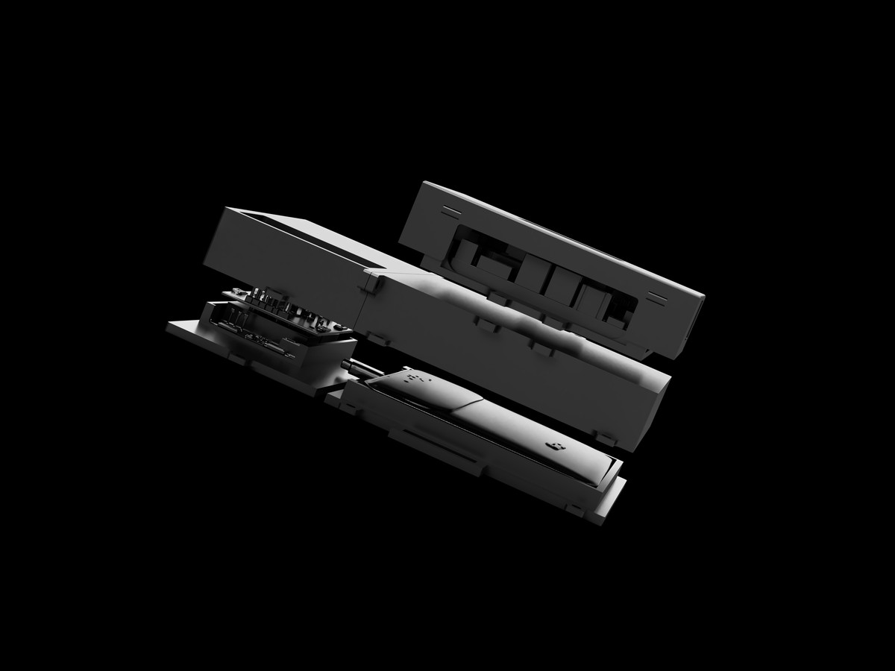

# Nyx


| 착용 사진 | 형상 사진 |
|---|---|
|  |  |

> GPS가 끊기고, 통신이 약해지고, 공간이 반복될 때  
> Nyx는 대원에게 “계속 가라”가 아니라 **마지막으로 믿을 수 있는 기준**을 돌려줍니다.

Nyx는 GPS와 통신이 끊긴 지하, 도심, 참호 작전에서 전방 대원이 경로, 접촉, 인계 판단을 잃지 않게 하는 온디바이스 AI 코파일럿입니다.

Nyx는 전술 지휘 체계가 아닙니다. 사람, 위협, 무기, 위험물, 진입 가능 여부를
식별하거나 확정하지 않습니다. 이 공개 레포는 **신호가 약한 공간에서 과신을 막는
인터페이스 패턴**을 보여주는 D4D 제출용 데모입니다.

```text
분리된 관측 -> 현장 상태 압축 -> 짧은 행동 카드 -> 사람의 최종 판단
```

## 핵심 내용 1 - 문제

| 영관급 판단 포인트 | 현장 현실 |
|---|---|
| 로봇은 필요하지만 충분하지 않습니다. | 지하·시가전·참호는 통로가 좁고 전개가 빠르며, 마지막 확인은 여전히 사람이 합니다. |
| 장비가 늘어도 판단은 자동으로 빨라지지 않습니다. | 열상·야간, 지도·위치, 거리 감지, 무전, 로봇 인계가 서로 다른 화면과 절차로 흩어집니다. |
| 위험은 정보 부족보다 과잉 확정에서 커집니다. | 반복 구조, 미확인 열원, 끊긴 통신 속에서 대원은 “계속 가도 되는지”를 몇 초 안에 정해야 합니다. |

Nyx 데모는 약 1.5kg, 25 x 15 x 7cm 내외의 착용형 폼팩터에서 흩어진 관측을 한 화면의 현장 상태로 묶습니다.

## 핵심 내용 2 - 사용자

| 누가 | 어떤 작전에서 겪는 문제 | Nyx가 돕는 방식 |
|---|---|---|
| 지하·도심 구획실 수색 대원 | 반복 통로와 유사 랜드마크 때문에 마지막 체크포인트가 흐려집니다. | `route confidence`를 낮추고 마지막 기준점으로 재정렬시킵니다. |
| 참호·엄폐 공간 이동 대원 | 재밍, 드론 위협, 우회로 속에서 이동/정지 판단이 흔들립니다. | 경로 이탈 위험과 확정 금지 상태를 HUD에 남깁니다. |
| 공병/EOD·로봇 연계 대원 | 미확인 열원이나 작은 물체를 사람, 위험물, 안전물로 바로 확정하기 어렵습니다. | 표시, 이격, 재확인, 로봇/전문팀 인계를 카드로 정리합니다. |

## 핵심 내용 3 - 솔루션

```text
RGB/depth + thermal + ultrasonic + IMU
        -> route / contact / egress / device state
        -> ORIENT / REALIGN / MARK / STANDOFF / HANDOFF
```

| 카드 | 의미 |
|---|---|
| ORIENT / REALIGN | 길 안내가 아니라 마지막 검증 체크포인트와 임무 의도를 회복합니다. |
| MARK / STANDOFF | 사람/위험/안전을 확정하지 않고 의심 지점과 이격 기준을 남깁니다. |
| CONFIRM / HANDOFF | 대원, 로봇, 전문팀이 이어받을 수 있도록 판단 근거를 짧게 정리합니다. |

## 기대 개선 효과

| 항목 | 현재 부담 | Nyx 데모 기준 추정 |
|---|---|---|
| 장비 해석 | 열상, 지도, 거리, 무전, 로봇 인계 단서가 분리됨 | 4-5개 단서를 `경로 / 접촉 / 퇴로 / 인계` 상태 카드 1장으로 압축 |
| 판단 속도 | “계속 전진, 정지, 재확인, 인계”를 말로 조율 | 다음 행동을 3개 이하로 제한해 선택지를 줄임 |
| 인계 품질 | 무전으로 상황을 다시 설명하며 누락 가능 | 체크포인트, 의심 지점, 금지 행동을 같은 형식으로 남김 |

목표 효과는 더 공격적인 판단이 아니라 **오판 가능성이 큰 순간에 전진을 늦추고, 재정렬과 인계를 빠르게 만드는 것**입니다.
